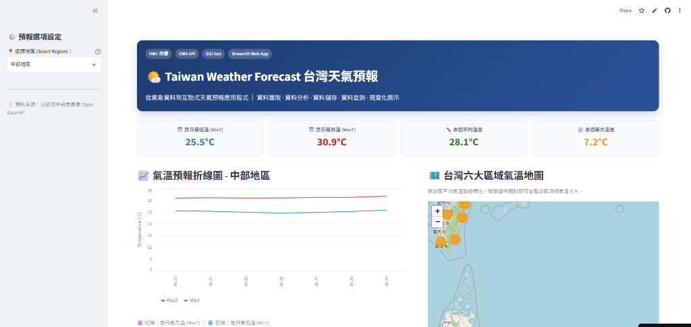
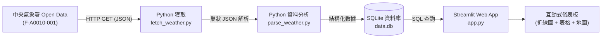

# 🌤️ Taiwan Weather Forecast 台灣天氣預報應用程式

> **從氣象資料到互動式天氣預報 Web 應用程式**  
> 整合 **CWA API × JSON × Python × SQLite × Streamlit**，實現資料獲取、解析、儲存、查詢與視覺化展示。

[](https://hw1-taiwan-weather-forecst-snuohwhhhdp3thdtc5tr6b.streamlit.app/)
[](https://github.com/czk001167-hash/HW1-Taiwan-weather-forecst)

🚀 **線上即時展示 (Live Demo)**：[https://hw1-taiwan-weather-forecst-snuohwhhhdp3thdtc5tr6b.streamlit.app/](https://hw1-taiwan-weather-forecst-snuohwhhhdp3thdtc5tr6b.streamlit.app/)



---

## 📌 專案簡介 (Overview)

本專案透過串接交通部中央氣象署（CWA）開放資料 API，取得台灣六大區域（北部、中部、南部、東北部、東部、東南部）之一週天氣預報。利用 Python 進行資料分析與清洗，將標準化氣溫資料持久化存入 SQLite 資料庫，並最終使用 Streamlit 建立具備即時篩選、折線圖表、詳細數據表與互動式地圖的天氣儀表板。

### 🎯 學習與實作目標
- [x] **學會使用 Open Data API**：串接中央氣象署 API（F-A0010-001）
- [x] **掌握 JSON 資料結構分析**：多層巢狀結構解析與提取
- [x] **建立 SQLite 資料庫**：資料表設計（Schema）、寫入與 SQL 條件查詢
- [x] **使用 Streamlit 製作互動式 Web App**：打造現代化資料視覺化介面
- [x] **培養資料處理與視覺化能力**：結合 Folium 地圖與 Altair/Plotly 趨勢圖表

---

## 🔄 系統架構與資料流程 (Data Pipeline)



---

## 🧩 核心功能模組

### 1. 取得 CWA API 資料 (`fetch_weather.py`)
- **目標**：呼叫 CWA API 取得台灣六大區域一週天氣預報（JSON 格式）。
- **涵蓋區域**：北部地區、中部地區、南部地區、東北部地區、東部地區、東南部地區。
- **資料集代碼**：`F-A0010-001`（一般天氣預報 - 一週天氣預報）。

### 2. 分析 JSON，提取氣溫資料 (`parse_weather.py`)
- **目標**：解析階層式 JSON，精準提取每日最高溫（`MaxT`）與最低溫（`MinT`）。
- **JSON 層級架構**：
  ```text
  records
  └── locations
      └── location[] (六大地區)
          └── weatherElement[] (天氣要素)
              └── time[] (預報時間區段)
                  ├── elementName: MinT (最低溫)
                  └── elementName: MaxT (最高溫)
  ```
- **提取資料範例**：
  | regionName | dataDate | minT | maxT |
  | :--- | :---: | :---: | :---: |
  | 北部地區 | 2026-04-14 | 18.0 | 26.0 |
  | 中部地區 | 2026-04-14 | 20.0 | 30.0 |
  | 南部地區 | 2026-04-14 | 22.0 | 31.0 |

### 3. 存入 SQLite 資料庫 (`database.py`)
- **資料表設計** (`data.db`)：
  ```sql
  CREATE TABLE TemperatureForecasts (
      id INTEGER PRIMARY KEY AUTOINCREMENT,
      regionName TEXT,
      dataDate TEXT,
      minT REAL,
      maxT REAL
  );
  ```
- **驗證查詢範例**：
  ```sql
  -- 列出所有地區
  SELECT DISTINCT regionName FROM TemperatureForecasts;

  -- 查詢中部地區一週預報
  SELECT * FROM TemperatureForecasts WHERE regionName = '中部地區';
  ```

### 4. Streamlit 氣溫預報 Web App (`app.py`)
- **功能需求**：
  1. **下拉選單**：支援切換六大區域。
  2. **SQLite 查詢**：透過 SQL 語法從本機資料庫提取預報數據。
  3. **雙折線圖**：動態展示選定區域一週內最高溫（MaxT）與最低溫（MinT）趨勢。
  4. **數據表格**：條列一週（7天）詳細日期與溫度對照。

### 5. 進階：台灣地圖視覺化 (Optional)
- **視覺化技術**：`Folium` + `streamlit-folium`
- **溫度區間色彩標註**：
  - 🔵 **< 20°C**：低溫（藍色）
  - 🟢 **20°C ~ 25°C**：舒適（綠色）
  - 🟡 **25°C ~ 30°C**：溫暖（黃色）
  - 🔴 **> 30°C**：炎熱（紅色）
- **地圖互動**：各區域中心標記互動點，點擊可查看當日平均溫與氣溫資訊卡。

---

## 📂 專案檔案結構 (Project Structure)

```text
HW1-Taiwan-weather-forecst/
├── fetch_weather.py      # 模組 1：呼叫 CWA API 並取得原始 JSON
├── parse_weather.py      # 模組 2：解析 JSON 並抽取六大區域氣溫資料
├── database.py           # 模組 3：建立 SQLite 資料庫並存入氣溫預報資料
├── app.py                # 模組 4 & 5：Streamlit 互動式 Web 儀表板與地圖
├── data.db               # SQLite 本機資料庫 (由 database.py 產生)
├── weather_data.csv      # (可選) 處理後之中間 CSV 檔案
├── requirements.txt      # 專案相依 Python 套件清單
├── .gitignore            # Git 忽略設定 (保護 API Key 與環境檔案)
└── README.md             # 專案完整說明文件
```

---

## 🚀 快速開始與執行指南 (Getting Started)

### 1. 建立虛擬環境（建議）
```bash
# Windows
python -m venv venv
.\venv\Scripts\activate

# macOS / Linux
python3 -m venv venv
source venv/bin/activate
```

### 2. 安裝必要套件
```bash
pip install -r requirements.txt
```

> **必要套件清單**：`requests`, `pandas`, `streamlit`, `folium`, `streamlit-folium`

### 3. 設定氣象署 API 金鑰
請向 [中央氣象署開放資料平台](https://opendata.cwa.gov.tw/) 申請個人授權金鑰，並於專案中設定。

### 4. 執行資料處理流程（一次即可）
```bash
python fetch_weather.py
python parse_weather.py
python database.py
```

### 5. 啟動 Streamlit Web 應用程式
```bash
streamlit run app.py
```

---

## ⚠️ 重要注意事項
1. **API Key 安全**：請使用個人 CWA API Key，勿將個人金鑰直接寫死並公開推送至 GitHub。
2. **架構規範**：Streamlit Web App **必須從 SQLite 資料庫查詢資料**，嚴禁在前端直接連線呼叫 API。
3. **資料完整性**：請確認六大區域資料皆正確擷取，表格與圖表須完整呈現一週（7天）預報。
