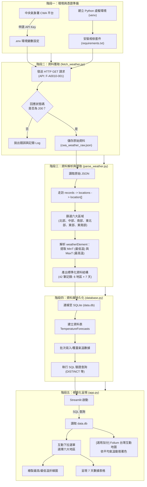

# 📋 專案完整開發與執行流程 (Project Workflow)

> 本文件詳細說明 **台灣天氣預報應用程式（Taiwan Weather Forecast）** 從零到完成的完整生命週期與資料處理管線（Data Pipeline）。

---

## 🗺️ 全體架構與工作流程圖 (End-to-End Pipeline)



---

## 📌 各階段執行細節指南

### 階段 1：環境設定與 API 金鑰 (Environment & Credentials)

1. **申請中央氣象署 API 金鑰**：
   - 前往 [中央氣象署開放資料平台會員中心](https://opendata.cwa.gov.tw/)。
   - 註冊並取得專屬授權碼（Authorization Key，格式如 `CWA-XXXXXXXX-XXXX-...`）。
2. **設定環境變數**：
   - 於專案根目錄建立 `.env`（已加入 `.gitignore` 避免金鑰公開）：
     ```env
     CWA_API_KEY=YOUR_PERSONAL_API_KEY_HERE
     ```
3. **建立與啟動虛擬環境**：
   ```bash
   python -m venv venv
   # Windows PowerShell
   .\venv\Scripts\Activate.ps1
   # macOS / Linux
   source venv/bin/activate
   ```
4. **安裝相依套件**：
   ```bash
   pip install -r requirements.txt
   ```

---

### 階段 2：資料獲取模組 (`fetch_weather.py`)

- **功能責任**：負責安全串接 CWA API，擷取台灣一週預報原始資料。
- **輸入 (Input)**：
  - API 端點：`https://opendata.cwa.gov.tw/api/v1/rest/datastore/F-A0010-001`
  - 授權 Header：`Authorization: YOUR_API_KEY`
  - 參數設定：`format=JSON`
- **邏輯步驟**：
  1. 使用 `requests.get()` 發送 HTTP 請求（設定 `timeout=30`）。
  2. 檢查 HTTP 狀態碼是否為 200。
  3. 驗證回傳 JSON 是否包含 `records` 節點。
  4. 輸出儲存為中間暫存檔（例如 `cwa_weather_raw.json`）以利後續離線偵錯與重覆解析。
- **驗證指標**：
  - JSON 格式合法且無錯誤訊息。

---

### 階段 3：資料分析與提取 (`parse_weather.py`)

- **功能責任**：剖析多層巢狀 JSON，萃取核心溫度維度並標準化格式。
- **JSON 結構對應**：
  ```text
  records
  └── locations
      └── location[] --------------------> 地區名稱 (locationName)
          └── weatherElement[]
              ├── elementName: "MinT" ---> 最低溫資料
              │   └── time[] ------------> 每日預報時間 (startTime / endTime)
              │       └── elementValue[0].value
              └── elementName: "MaxT" ---> 最高溫資料
                  └── time[]
                      └── elementValue[0].value
  ```
- **處理邏輯**：
  1. 篩選目標為以下 6 大區域：
     - `北部地區`、`中部地區`、`南部地區`、`東北部地區`、`東部地區`、`東南部地區`
  2. 提取每日預報日期（取 `YYYY-MM-DD` 格式）。
  3. 將字串溫度轉換為浮點數（`float`）。
  4. 整合並對齊每日最高溫與最低溫。
- **輸出規格 (DataFrame / Dict 清單)**：
  - 總筆數：6 地區 × 7 天 = **42 筆記錄**。
  - 欄位：`regionName` (TEXT), `dataDate` (TEXT), `minT` (REAL), `maxT` (REAL)。

---

### 階段 4：SQLite 資料庫持久化 (`database.py`)

- **功能責任**：建立關聯式資料庫，將分析後的資料結構化持久儲存，並支援條件索引查詢。
- **資料庫檔案**：`data.db`
- **資料表綱要 (Schema)**：
  ```sql
  CREATE TABLE IF NOT EXISTS TemperatureForecasts (
      id INTEGER PRIMARY KEY AUTOINCREMENT,
      regionName TEXT NOT NULL,
      dataDate TEXT NOT NULL,
      minT REAL NOT NULL,
      maxT REAL NOT NULL,
      UNIQUE(regionName, dataDate) ON CONFLICT REPLACE
  );
  ```
- **邏輯步驟**：
  1. 透過 `sqlite3.connect("data.db")` 建立連線。
  2. 建立資料表與唯一約束（避免重複寫入造成髒資料）。
  3. 使用 `executemany()` 批次寫入 42 筆資料。
  4. 執行確認查詢，並輸出驗證結果至終端機：
     ```sql
     -- 驗證六大地區完整性
     SELECT DISTINCT regionName FROM TemperatureForecasts;

     -- 驗證中部地區 7 天資料
     SELECT * FROM TemperatureForecasts WHERE regionName = '中部地區' ORDER BY dataDate ASC;
     ```

---

### 階段 5：Streamlit 互動式 Web 儀表板 (`app.py`)

- **功能責任**：從 SQLite 讀取數據，打造具現代感的天氣資訊視覺化互動面板。
- **核心架構規則**：
  - ⚠️ **嚴格禁止在 Streamlit 前端直接連線 CWA API**，所有數據必須自 `data.db` 讀取。
- **UI 元件與功能清單**：
  1. **頂部/側邊欄選單**：
     - `st.selectbox`：提供「北部地區、中部地區、南部地區、東北部地區、東部地區、東南部地區」下拉選單。
  2. **指標卡片 (KPI Metrics)**：
     - 顯示所選地區今日預報氣溫、本週最高溫、本週最低溫。
  3. **一週雙折線圖 (Trend Chart)**：
     - 紅色曲線代表最高溫（MaxT）、藍色曲線代表最低溫（MinT）。
     - X 軸為日期（MM/DD），Y 軸為溫度（°C）。
  4. **數據明細表格**：
     - 使用 `st.dataframe` 呈現完整一週預報（Date, MinT, MaxT）。
  5. **[選用加分] 台灣地圖視覺化 (Folium Map)**：
     - 整合 `folium` 與 `streamlit-folium`。
     - 計算各區域當日或週均溫，動態套用顏色標記：
       - 🔵 `< 20°C`（低溫）
       - 🟢 `20°C ~ 25°C`（舒適）
       - 🟡 `25°C ~ 30°C`（溫暖）
       - 🔴 `> 30°C`（炎熱）
     - 點擊各區標記彈出預報摘要卡片。

---

## 🚦 專案執行順序清單 (Command Cheatsheet)

依序在終端機執行下列指令即可完成全流程：

```bash
# 步驟 1：取得原始資料
python fetch_weather.py

# 步驟 2：解析並提取資料
python parse_weather.py

# 步驟 3：建立資料庫並寫入資料
python database.py

# 步驟 4：啟動 Web App
streamlit run app.py
```

---

## 🎯 驗收檢查清單 (Submission QA Checklist)

| 檢驗項目 | 規範標準 | 確認狀態 |
| :--- | :--- | :---: |
| **API 連線與安全性** | 使用自申請之 CWA API Key，未寫死於公開程式碼 | [ ] |
| **六大區域覆蓋率** | 北部、中部、南部、東北部、東部、東南部皆完整包含 | [ ] |
| **預報天數** | 每個地區具備完整 7 天（一週）的氣溫預報 | [ ] |
| **資料庫查詢規範** | Web App 僅自 `data.db` 使用 SQL 查詢資料，無直接對外 API 呼叫 | [ ] |
| **UI 互動與圖表** | 下拉選單切換流暢、雙折線圖清楚標示最高與最低溫、表格齊全 | [ ] |
| **加分功能（可選）** | 台灣互動地圖按溫度區間正確呈現不同顏色標記 | [ ] |
